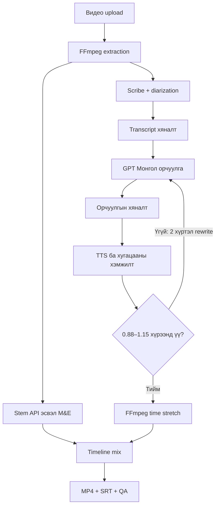

# shortkinomn — Монгол short drama streaming platform

Public streaming UI, хамгаалагдсан admin CMS, SQLite metadata, authentication, movie-level purchase болон үзсэн хугацааны хадгалалттай. Архитектур болон deployment-ийн хязгаарууд: [docs/PLATFORM.mn.md](docs/PLATFORM.mn.md).

Upload 500 оношилгоо, A/V timestamp normalize, цуцлалт, давхар төлбөрөөс хамгаалсан retry болон шалгалтын тайлан: [docs/RELIABILITY.mn.md](docs/RELIABILITY.mn.md).

Эхний production хувилбар **автомат Монгол хадмал + эх дуу** ашиглана. Dubbing, voice mapping, TTS, voice clone код хадгалагдсан боловч студид түр идэвхгүй (`apps/web/lib/features.ts`). Хадмалын ажил TTS болон арын дуу салгах API дуудахгүй.

## Production ажиллуулах

`apps/api/.env` дотор OpenAI болон ElevenLabs түлхүүр, FFmpeg/FFprobe зам тохируулна. Энэ урсгалд ElevenLabs **Speech to Text** эрх хэрэгтэй; Models/Voices Read эсвэл Text to Speech эрх ашиглахгүй.

```powershell
npm.cmd run typecheck
npm.cmd test
npm.cmd run build
npm.cmd start
```

`npm start` нь compiled Express API болон Next production серверийг ажиллуулж, процессын `NODE_ENV=production`, `PROVIDER_MODE=live` тохируулна. `.env` файлын утгуудыг дарж өөрчлөхгүй. Локал веб: http://localhost:3000. Гадаад deployment-д өөрийн домэйн, HTTPS reverse proxy, процессын supervisor болон өгөгдлийн backup тохируулна.

Админ урсгал: **Кино → Анги → Оруулах, хадмал бэлтгэх → Preview → эх яриа/орчуулгаа хянаж хадгалах → нийтлэх зөвшөөрлөө тэмдэглэх → Анги нийтлэх**. Видео оруулсны дараа STT, орчуулга, хадмал бэлтгэл автоматаар дараалж ажиллана. Автоматаар нийтлэхгүй, хүний хяналтыг автоматаар батлахгүй. Зөвхөн хяналтын тэмдэглэгээ хадгалахад бэлэн preview устахгүй; текст, хугацаа эсвэл контекст өөрчилбөл дахин бэлтгэнэ.

Browser player нь MP4-ийн эх дууг тоглуулж, тусдаа Монгол VTT track харуулна. Татсан MP4-д хадмал шатаагаагүй; SRT-г хамт татах боломжтой.

Бодит API шалгах (төлбөртэй хүсэлт илгээнэ):

```powershell
npm.cmd run check:live -- --run-paid
```

Энэ нь богино синтетик клипээр тусгаарласан production API дээр автомат хадмал шалгаж, үр дүнг `data/live-check/`-д хадгална. Нийтийн каталогт тест контент нэмэхгүй. `--with-dubbing` өгсөн үед л хадгалсан TTS оношилгоог нэмэлтээр ажиллуулна.

Доорх нь дахин ашигласан internal translation pipeline-ийн заавар. Studio одоо `/admin/translation` дээр байрлаж, ADMIN нэвтрэлт болон урьдчилан үүсгэсэн анги шаарддаг.

Next.js интерфэйс, Express API, TypeScript pipeline бүхий npm workspace төсөл.
Python, GPU, Docker, PostgreSQL, Redis шаардлагагүй. Эхний хувилбар локал нэг
production worker, нэг API процесс, нэг идэвхтэй job, 2–180 секундийн / 200 MB хүртэл
клип, 100 хүртэл ярианы мөр боловсруулна. Бүтэн кино боловсруулах production
систем хараахан биш. Эхлээд 30–60 секундийн клипээр бодит чанарыг үнэлнэ.

## 1. Компьютерт бэлтгэх

- Node.js 24 буюу түүнээс шинэ дэмжигдсэн хувилбар.
- FFmpeg болон ffprobe executable.
- VS Code. Git нь version control-д хэрэгтэй, ажиллуулахад заавал биш.

Албан ёсны татах хуудас:
- https://nodejs.org/en/download
- https://ffmpeg.org/download.html
- https://code.visualstudio.com/download
- https://git-scm.com/downloads

Windows дээр installer ашиглаж болно. Winget ашиглах бол package ID-г эхлээд
`winget search Node.js`, `winget search FFmpeg` гэж шалга. Байгаа тохирох
суулгалтыг бүү давхардуул. Шинэ суулгалтын дараа VS Code болон terminal-аа
дахин нээж PATH өөрчлөлтийг уншуул.

Terminal:

```powershell
node --version
npm --version
ffmpeg -version
ffprobe -version
```

PowerShell npm.ps1 execution policy алдаа өгвөл execution policy-г сулруулахын
оронд `npm.cmd` ашиглах эсвэл VS Code-ийн Command Prompt terminal сонго.
FFmpeg PATH-д байхгүй бол apps/api/.env дотор executable-ийн абсолют зам өг:

```dotenv
FFMPEG_PATH="C:/Tools/ffmpeg/bin/ffmpeg.exe"
FFPROBE_PATH="C:/Tools/ffmpeg/bin/ffprobe.exe"
```

## 2. Эхний удаа ажиллуулах

ZIP-ийг задлаад `mn-dub-ts` хавтсыг VS Code-д Open Folder хийнэ.
Terminal нь root package.json байгаа хавтаст байх ёстой.

```bash
npm ci
npm run setup
npm run doctor
npm test
npm run demo
npm run dev
```

Вэб: http://localhost:3000

`npm run setup` нь apps/api/.env файлыг байхгүй үед л үүсгэнэ.
Анхны `PROVIDER_MODE=demo`: ямар ч төлбөртэй API дуудахгүй.
`npm run demo` нь data/demo-input.mp4 туршилтын файлыг үүсгэнэ.

Demo хийх:

1. Админ студид ангиа сонгоод `data/demo-input.mp4` файлыг оруулна.
2. “Оруулах, хадмал бэлтгэх” дарна. Жишээ transcript, орчуулга болон preview автоматаар бэлэн болно.
3. Preview үзэж, хяналтын тэмдэглэгээ хадгалаад нийтлэхийг тусад нь батална.

Demo нь тогтмол жишээ өгүүлбэр ашигладаг; бодит орчуулга, Монгол яриа, voice cloning биш.
Жинхэнэ видео upload хийсэн ч demo горимд тэр яриаг танихгүй.

## 3. Бодит API горим

apps/api/.env:

```dotenv
PROVIDER_MODE=live
OPENAI_API_KEY=your_key_here
ELEVENLABS_API_KEY=your_key_here
TRANSLATION_MODEL=gpt-4o-2024-08-06
STT_MODEL=scribe_v2
TTS_MODEL=eleven_v4
```

Серверээ зогсоож дахин `npm run dev` ажиллуул. Live горимд шинэ job үүсгэ.
Demo job-ийг live горим руу автоматаар шилжүүлэхгүй.
API billing нь тусдаа; ChatGPT subscription-ийг API эрх гэж үзэхгүй.
API credentials-ийг зөвхөн backend .env-д хадгална; NEXT_PUBLIC_ хувьсагчид бүү хий.

Доорх нь хадгалж үлдээсэн dubbing pipeline-ийн техникийн урсгал. Одоогийн production студи дээрх автомат хадмалын урсгалыг ашиглана:

- FFmpeg эх audio track-ийг 16 kHz mono speech.wav болгоно.
- ElevenLabs Scribe API word timestamps болон speaker_id гаргана.
- Source words-ийг speaker, пауз, өгүүлбэрийн төгсгөл, 8 секундийн уртаар бүлэглэнэ.
- Хэрэглэгч эх transcript, speaker болон timeline-ийг засаж шалгана.
- GPT-4o Монгол орчуулгыг JSON Schema-тай гаргана. Нэг хүсэлтэд 15 мөр,
  өмнөх/дараах 6 мөр, synopsis, character description, glossary өгнө.
- Хэрэглэгч орчуулгаа засаж speaker тус бүрт ElevenLabs voice_id онооно.
- TTS → бодит урт хэмжих → шаардлагатай бол дахин найруулах → atempo.
- FFmpeg клипүүдийг absolute timeline дээр байрлуулж, bed-тай нийлүүлэн
  browser-compatible H.264/AAC MP4 үүсгэнэ. Монгол SRT болон QA JSON гарна.

Provider-ийн model access, Монгол дуудлага, quota болон API төлбөрийг богино
клипээр шалгана. Live API хүсэлт энэ бэлтгэлийн үед ажиллуулаагүй.

## 4. Арын дууны гурван сонголт

1. **Арын дуугүй:** эх audio-г бүхэлд нь шинэ яриагаар солино. UI дээр ил тод сонгоно.
2. **Бэлэн M&E:** эх видеотой ижил timeline, хугацаатай music/effects файлыг upload хийнэ.
3. **API separation:** ElevenLabs `/v1/music/stem-separation`, `two_stems_v1` ашиглана.

Audio isolation endpoint нь цэвэр speech гаргадаг; түүнээс background track
үүссэн гэж үзэж болохгүй. Код music stem-separation endpoint ашиглаж ZIP-ээс
instrumental/accompaniment/no_vocals/background нэртэй нэг stem-ийг сонгоно.
Нэршил өөр эсвэл олон таарвал автоматаар буруу stem сонгохгүй, алдаа өгнө.
Тэр тохиолдолд “Тусдаа M&E файлаар солих” үйлдлээр bed upload хийж, “Яриа
салгах”-ыг дахин ажиллуул. Өмнөх STT хадгалагдсан тул дахин API дуудахгүй.

Music separation нь киноны төгс M&E сэргээнэ гэсэн баталгаа биш. Эх яриа
үлдэх, SFX алдагдах, separation artifact гарахыг сонсож шалгана. MP3 stem-ийн
encoder delay/padding-аас жижиг зөрүү гарч болно. Арын дууны sync-ийг гараар
үнэлэх шаардлагатай. Original mix-ийг цэвэр bed-ийн оронд буцаан ашиглахгүй.

## 5. Voice cloning

Эхний туршилтад аккаунтад байгаа, ашиглах эрхтэй voice ID-гаа шууд оноож болно.
UI-ийн “Хоолой клон үүсгэх” хэсэг зөвшөөрөлтэй цэвэр audio sample, нэр,
зөвшөөрлийн лавлагаа авна. `/v1/voices/add` хариуг data/voices дотор хадгална.
`requires_verification=true` бол provider дээр баталгаажуулсны дараа ашиглана.
Voice sample-ийг job-ийн киноноос автоматаар тасалж клондохгүй: sample дотор
өөр хүний яриа, хөгжим, эффект байхгүйг хянана.

Хэл дамнасан clone-ийн өнгө, өргөлт, Монгол дуудлага ижил чанартай болно гэж
батлахгүй. Дүр бүрийн sample-аар сонсголын туршилт хийнэ. Эмоцийн нарийн
audio tags/prosody controller энэ MVP-д ороогүй.

## 6. Pipeline болон өгөгдөл



`data/jobs/<uuid>/job.json` нь үндсэн manifest. Мөр бүр:

```json
{
  "id":"s0", "start":1.2, "end":4.3,
  "speaker":"speaker_0", "source":"Don't leave me here.",
  "target":"Намайг энд битгий орхиоч.", "flags":[]
}
```

Timestamp нь видеоны эхлэлээс тоолсон секунд. Орчуулгын LLM timestamp
өөрчилж чадахгүй. Хугацааг хүн editor-оос засаж болно; end>start,
duration-аас хэтрээгүй, ID давхардаагүй, start-аар эрэмбэлэгдсэн байх ёстой.
Яригчдын давхар яриаг тусгай тэмдэглэгээгээр харуулна; нэг STT pass давхар
ярьсан бүх үгийг заавал гаргахгүй. Missing content-ийг хүн нөхөж засах хэрэгтэй.

`rate = actualSeconds / targetSeconds`. 4.4 секундийн аудиог 4 секунд болгох
утга 1.1. Нийт 3 TTS оролдлого, 2 хүртэл rewrite. Хэт их зөрүүтэй бол шууд
таслахгүй, хяналтад шилжүүлнэ. At tempo дараах 30ms хүртэл үлдэгдэл rounding
correction хийнэ; түүнээс их бол алдаа. Lip sync болон target word alignment байхгүй.

Эх яриа эсвэл контекст өөрчлөгдвөл хуучин орчуулга хүчингүй болно. Хадгалах
үед хуучин rendered output-ийг устгаж, шинэ render шаардана. Revision field
зэрэгцээ editor өөрчлөлтийг мөргөлдөхөөс сэргийлнэ.

## 7. Төслийн файлууд

| Байршил | Үүрэг |
|---|---|
| apps/web/app/page.tsx | Upload, job list, transcript/translation editor, voice mapping, preview |
| apps/web/app/style.css | Responsive UI |
| apps/api/src/server.ts | HTTP API, upload, input validation, safe artifact routes |
| apps/api/src/model.ts | Zod schemas, word grouping, timeline, SRT |
| apps/api/src/providers.ts | Scribe, GPT, TTS, cloning, stem separation, cache |
| apps/api/src/media.ts | FFmpeg child processes, probe, fit, mix, MP4 |
| apps/api/src/workflow.ts | Job stages, checkpoint, rewrite loop |
| apps/api/src/store.ts | JSON manifest, atomic save, restart recovery |
| scripts/doctor.mjs | Node/FFmpeg/key presence check; secrets хэвлэхгүй |
| scripts/smoke.mjs | Тусдаа demo API process дээр HTTP end-to-end test |
| VSCODE_PROMPT.mn.md | VS Code AI setup prompt |
| package-lock.json | Суулгасан dependency-ийн lock |

API routes:

| Method | Route | Үйлдэл |
|---|---|---|
| GET | /api/health | Environment checks |
| GET / POST | /api/jobs | Jobs жагсаалт / video upload |
| GET / PATCH | /api/jobs/:id | Manifest авах / editor хадгалах |
| POST | /api/jobs/:id/prepare | STT + background preparation |
| POST | /api/jobs/:id/translate | Монгол орчуулга |
| POST | /api/jobs/:id/render | TTS + MP4/SRT |
| POST | /api/jobs/:id/bed | Шинэ M&E upload |
| GET | /api/jobs/:id/files/:file | Whitelist файл татах, MP4 range playback |
| POST | /api/voices/clone | Зөвшөөрөлтэй sample-аас clone |

Mutating request бүр `x-mn-dub: 1` header ашиглана. Backend зөвхөн loopback
дээр bind хийнэ. Next.js /api rewrite нь backend рүү дамжуулна. PORT өөрчилбөл
apps/web/next.config.ts proxy destination-ийг мөн шинэчил.

## 8. Тест болон баталгаажуулалт

```bash
npm run typecheck
npm test
npm run demo
npm run smoke
npm run build
```

2026-09-29-ний энэ бэлтгэл дээр:
- Node 24.19.0, FFmpeg 6.1.1 орчинд backend/frontend typecheck амжилттай.
- 7 тест: SRT carry, speaker grouping, unknown/overlap flags, timeline validation,
  LLM ID validation, бодит FFmpeg fit болон бүрэн MP4 render амжилттай.
- HTTP smoke: upload → prepare → edit → translate → render → MP4/SRT амжилттай.
- Range playback, mutation header, revision conflict, source edit-ийн дараах
  translation invalidation болон stale output blocking шалгасан.
- Next.js production build амжилттай.
- Бодит provider API болон browser-ийн визуал шалгалт хийгдээгүй.

Нэг build амжилттай болсон нь Монгол орчуулга/TTS-ийн чанар батлагдсан гэсэн үг биш.

## 9. Дараагийн шат

- API key-тай 30–60 секундийн бодит клипийн integration test.
- Монгол нэр, Ө/Ү, тоо, слэнг, хүндэтгэлийн хэлбэр, дуудлагын редакторын QA.
- Scene detection, word-level alignment, accurate overlap handling.
- PostgreSQL, queue/worker, object storage, account/auth, job cancellation.
- Өртөг тооцох, quota, retry/backoff, request ID болон billed attempt ledger.
- Бүтэн кинонд scene batching, global speaker identity, урт хугацааны checkpoints.
- LUFS/true-peak audio mastering, 5.1/7.1, lip sync.

Одоогийн cache нь model/settings/input hash-д суурилна; provider model-ийн
хувилбар ID өөрчлөгдөхгүй шинэчлэгдсэн бол cache-ийг өөр namespace-д шилжүүлнэ.
Paid POST-ийг blind retry хийхгүй. Lost response аль хэдийн billed байж болно;
дахин товч дарах үед давхар төлбөр гарах эрсдэлийг provider history-оор тулгана.
Restart үед идэвхтэй job failed болно; дур мэдэн дахин paid call хийхгүй.

Input A/V start_time нь 0±20ms шаардлагатай. Бусад timeline-ийг эх offset-ийг
хадгалан ingest дээр normalize хийнэ; audio/video-г тус тусад нь zero болгохгүй.
Эхний audio stream сонгогдоно. Олон хэлний track-тай бол зөв track-ийг урьдчилан сонго.

Энэ нь localhost хөгжүүлэлтийн app: login байхгүй, public deployment хийхэд
бэлэн биш. Нэг shared data directory дээр олон API процесс ажиллуулж болохгүй.

## Албан ёсны эх сурвалж

- https://nextjs.org/docs/app/getting-started/installation
- https://expressjs.com/en/starter/installing/
- https://developers.openai.com/api/docs/guides/structured-outputs
- https://elevenlabs.io/docs/api-reference/speech-to-text/convert
- https://elevenlabs.io/docs/api-reference/music/separate-stems
- https://elevenlabs.io/docs/api-reference/text-to-speech/convert
- https://elevenlabs.io/docs/api-reference/voices/ivc/create
- https://elevenlabs.io/docs/overview/models
- https://ffmpeg.org/ffmpeg-filters.html

